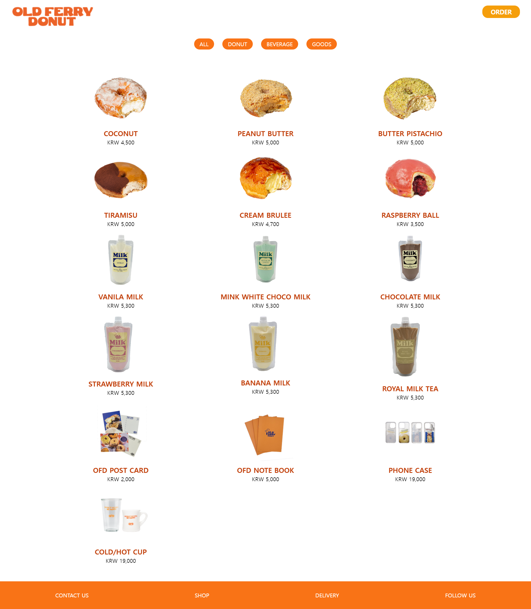
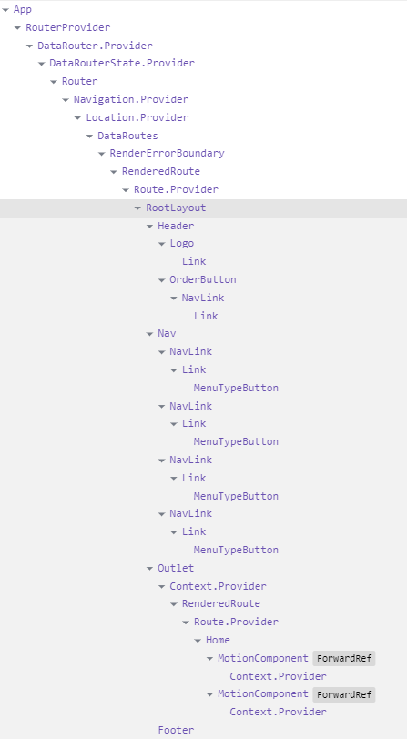
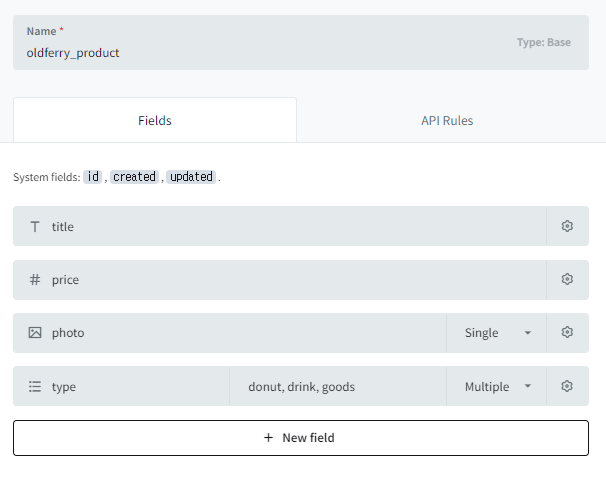
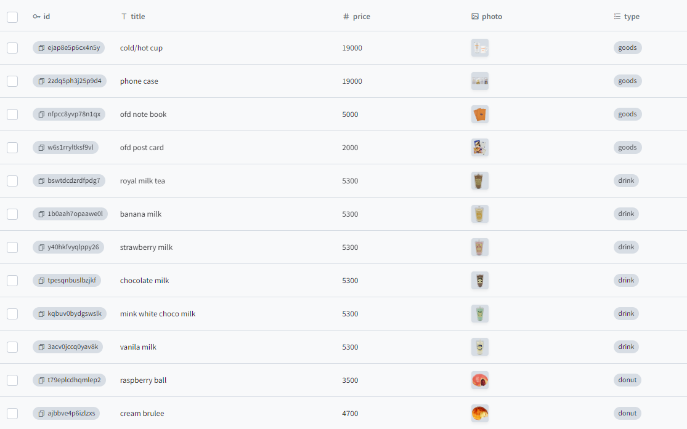

## 🍩 Old Ferry Donut
### :link: 참고 사이트
https://www.oldferrydonutus.com/

## :camera: 결과 스크린샷



## :speech_balloon: 코드리뷰
### 컴포넌트 구성
  

### pocketbase
  - collection
    
    

### Framer Motion 애니메이션
- Home.jsx
  ```jsx
    import { motion } from "framer-motion"
  ```
  ```jsx
  <section className="flex mx-40 flex-wrap">
    <div className="relative flex-auto w-1/2 h-1/2">
      <motion.img initial={{scale: 0.8}} animate={{scale:1.0}} transition={{duration:0.5}} src="/main/donut03.webp" alt="donut03"/>
      <span className="absolute text-orange-600 text-center font-extrabold text-7xl top-1/2 left-1/2 -translate-x-1/2 -translate-y-1/2">DONUT WORRY,<br/> BE HAPPY!</span>
    </div>
    <div className="relative flex-auto w-1/2">
        
      <motion.img initial={{scale: 0}} animate={{rotate:360, scale:1}} src="/main/ofdEat01.png" alt="ofdEat01" className="absolute w-3/4 top-14  left-14"/>
    </div>
  </section>
  ```

### Router

- routs.jsx
  - 구현되지 않은 Link는 <em>NotFound.jsx</em>로 이동
  ```jsx
    import { createBrowserRouter } from 'react-router-dom';
    import Home from '@/views/Home';
    import ProductList from '@/views/ProductList';
    import RootLayout from '@/views/RootLayout';
    import NotFound from '@/views/NotFound';
    import Order from '@/views/Order';

    const router = createBrowserRouter([
      { path: '/', 
        element: <RootLayout />,
        errorElement: <NotFound />,
        children: [
          { index: true, element: <Home /> },
          { path: 'products', element: <ProductList /> },
          { path: 'order', element: <Order /> }
        ]
      }
    ]);

    export default router;
  ```
- RootLayout.jsx
  ```jsx
  import Header from "@/views/Header"
  import Nav from '@/views/Nav';
  import Footer from '@/views/Footer';
  import { Outlet } from "react-router-dom";


  function RootLayout() {
    return (
      <>
        <Header/>
        <Nav/>
        <main>
          <Outlet/>
        </main>
        <Footer/>
      </>
    )
  }

  export default RootLayout
  ```  
- Nav.jsx
  ```jsx
  import MenuTypeButton from "@/components/MenuTypeButton"
  import { NavLink } from 'react-router-dom';

  function Nav() {
    return (
      <>
        <ul className="flex flex-row justify-center gap-6 mb-14">
          <li><NavLink to="/products"><MenuTypeButton type="all"/></NavLink></li>
          <li><NavLink to="/donut"><MenuTypeButton type="donut"/></NavLink></li>
          <li><NavLink to="/beverage"><MenuTypeButton type="beverage"/></NavLink></li>
          <li><NavLink to="/goods"><MenuTypeButton type="goods"/></NavLink></li>
        </ul>
      </>
    )
  }

  export default Nav
  ```  
- MenuTypeButton 컴포넌트
  
  ```jsx
  function MenuTypeButton({type}) {
    return (
      <button className="bg-orange-500 text-white px-4 py-1 rounded-full uppercase">{type}</button>
      )
    }

    export default MenuTypeButton
  ```

### 리스트 렌더링
- ProductList.jsx
  ```jsx
  import Spinner from '@/components/Spinner';
  import useFetchData from '@/hooks/useFetchData';
  import ProductItem from '@/components/ProductItem';

  const PB_PRODUCTS_ENDPOINT = `http://127.0.0.1:8090/api/collections/oldferry_product/records`;

  function ProductList() {
    const { data, isLoading, error } = useFetchData(PB_PRODUCTS_ENDPOINT);

    // 로딩 중인 경우 화면
    if (isLoading) {
      return <Spinner size={160} title="데이터 가져오는 중이에요." />;
    }

    // 오류가 발생한 경우 화면
    if (error) {
      return (
        <div role="alert">
          <h2>{error.type}</h2>
          <p>{error.message}</p>
        </div>
      );
    }

    return (
      <ul className="grid grid-cols-3 mx-40 gap-x-10 gap-y-3">
        {data &&
          data.items &&
          data.items?.map((item) => <ProductItem key={item.id} item={item} />)}
      </ul>
    );
  }

  export default ProductList
  ```
- ProductItem 컴포넌트
  ```jsx
  import { getPbImageURL } from '@/utils';

  function ProductItem({ item }) {
    return (
      <li>
        <figure className="flex flex-col gap-3 items-center">
          
          <figcaption className="flex flex-col text-center">
            <span className="title text-orange-700 font-extrabold text-xl uppercase">
              {item.title}
            </span>
            <span className="price">KRW {item.price.toLocaleString()}</span>
          </figcaption>
        </figure>
      </li>
    );
  }

  export default ProductItem;
  ```

### To-do
- 폰트 변경
- 반응형
- 조건부 렌더링(products type별)
- 'ORDER' 구현
- 배포
  
하..겠지...?